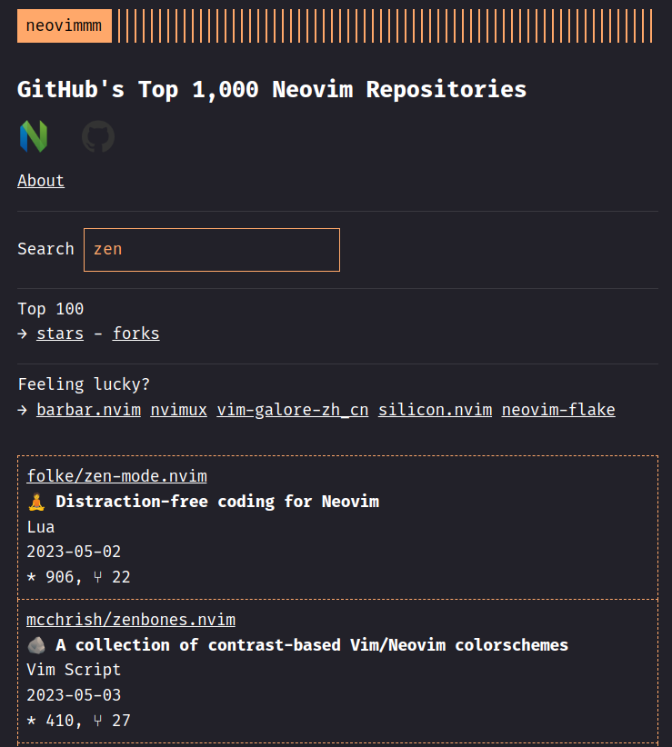

# neovimmm

Recently, I fell in love with Neovim and went down the rabbit hole of (Neo)Vim plugins.

So I decided to create [neovimmm](https://tomdeneire.github.io/neovimmm/), a small browsing tool for GitHub's top 1000 Neovim plugins!

I used GitHub's API for this, but unfortunately, both GitHub's [REST](https://docs.github.com/en/rest/search?apiVersion=2022-11-28) and [GraphQL](https://docs.github.com/en/graphql/overview/resource-limitations) APIs limit results to 1,000 items. On the flip side, GitHub does seem to suggest that these are the top 1,000 results:

> Think of it the way you think of performing a search on Google. It's designed to help you find the one result you're looking for (or maybe the few results you're looking for). Just like searching on Google, you sometimes want to see a few pages of search results so that you can find the item that best meets your needs. To satisfy that need, the GitHub REST API provides up to 1,000 results for each search.

So check [neovimmm](https://tomdeneire.github.io/neovimmm/) out! The page also features the top 100 repos for stars and forks.

If you're interested in more Neovim content, check out my posts on Medium:

- [TIL: Vim motions](https://tomdeneire.medium.com/til-vim-motions-49ef8ca8f064)
- [VSCode vs Neovim](https://tomdeneire.medium.com/vscode-vs-neovim-164cfc7b8399)
- [NeoVim Conference 2022 (Day 1)](https://tomdeneire.medium.com/neovim-conference-2022-day-1-b65099ce3391)
- [NeoVim Conference 2022 (day 2)](https://tomdeneire.medium.com/neovim-conference-2022-day-2-24820d8226e)

